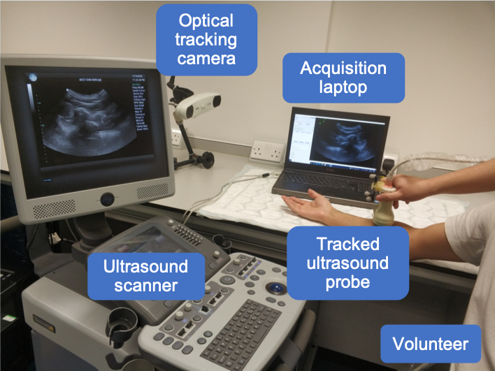

# The Data set

The data in this challenge is acquired from both left and right forearms of 85 volunteers, acquired at University College London, London, U.K, with a racial-, gender-, age-diverse subject cohort. [Fig. 3](#figure3) shows the equipment setting during acquisition. No specific exclusion criteria as long as the participants do not have allergies or skin conditions which may be exacerbated by US gel. All scanned forearms are in good health. The data is randomly split into training, validation, and test sets of 50, 3, and 32 subjects (100, 6, 64 scans; ~162k, ~9k, ~89k frames), respectively.

<div align=center>
  <a 
  target="_blank">
  
</a>

</div >
<div align=center>
Fig. 3. Freehand US data acquisition system.
</div>


<!-- **The train data is split into three parts: [Part 1](https://zenodo.org/doi/10.5281/zenodo.11178508), [Part 2](https://zenodo.org/doi/10.5281/zenodo.11180794), and [Part 3](https://zenodo.org/doi/10.5281/zenodo.11355499).** -->

## Images

The 2D US images were acquired using an Ultrasonix machine (BK, Europe) with a curvilinear probe (4DC7-3/40). The acquired US frames were recorded at 20 fps, with an image size of 480×640, without speckle reduction. The frequency was set at 6MHz with a dynamic range of 83 dB, an overall gain of 48% and a depth of 9 cm. Both left and right forearms of volunteers were scanned. For each forearm, the US probe was positioned near the elbow and moved around the fixed contact point. It was first fanned side-to-side along the short axis of the skin-probe interface and then rocked along the long axis in a similar manner. Afterwards, the probe was rotated about 90 degrees, and the fanning and rocking motions were repeated. The dataset contains 170 scans in total, 2 scans associated with each subject, around 1500 frames for each scan.

## Labels / Transformations

The position information recorded by the optical tracker (NDI Polaris Vicra, Northern Digital Inc., Canada) will be provided along with the images, which indicates the position of the US probe for each frame in the camera coordinate system, described as homogeneous transformation matrix with respect to reference frame. A calibration matrix will also be provided, denoting the transformation between US image coordinate system and US probe coordinate system while these data were acquired. The data is provided temporally calibrated, aligning the timestamps for both transformation from the optical tracker and ultrasound frames from US machine.

## Training Data Structure 

```bash

Freehand_US_data_train_2025/ 
    │
    ├── frames_transfs/
        ├── 000/
            ├── RH_rotating.h5 # US frames and associated transformations (from tracker tool space to optical camera space) in rotating scan of right forearm, subject 000
            ├── LH_rotating.h5 # US frames and associated transformations (from tracker tool space to optical camera space) in rotating scan of left forearm, subject 000
        ├── 001/
            ├── RH_rotating.h5 # US frames and associated transformations (from tracker tool space to optical camera space) in rotating scan of right forearm, subject 001
            ├── LH_rotating.h5 # US frames and associated transformations (from tracker tool space to optical camera space) in rotating scan of left forearm, subject 001
        ├── ...

    ├── landmarks/
        ├── landmark_000.h5 # landmarks in scans of subject 000
        ├── landmark_001.h5 # landmarks in scans of subject 001
        ├── ...

    ├── calib_matrix.csv # calibration matrix
    # ├── dataset_keys.h5 # the paths to all the scans of the data set

```

* Folder `frames_transfs`: contains 50 folders (one subject per folder), each with 2 scans. Each .h5 file corresponds to one scan, storing image and transformation of each frame within this scan. Key-value pairs and name of each .h5 file are explained below. 
    * `frames` - All frames in the scan; with a shape of [N,H,W], where N refers to the number of frames in the scan, H and W denote the height and width of a frame.

    * `tforms` - All transformations in the scan; with a shape of [N,4,4], where N is the number of frames in the scan, and the transformation matrix denotes the transformation from tracker tool space to camera space. 

    * Notations in the name of each .h5 file: `RH`: right arm; `LH`: left arm. For example, `RH_rotating.h5` denotes a rotating scan on the right forearm. 

* Folder `landmark`: contains 50 .h5 files. Each corresponds to one subject, storing coordinates of landmarks for 2 scans of this subject. For each scan, the coordinates are stored in numpy array with a shape of [100,3]. The first column is the index of frame; the second and third columns denote the coordinates of landmarks in the image coordinate system.

* Calibration matrix: The calibration matrix was obtained using a pinhead-based method. The `scaling_from_pixel_to_mm` and `spatial_calibration_from_image_coordinate_system_to_tracking_tool_coordinate_system` are provided in the “calib_matrix.csv”. 

<!-- * `dataset_keys.h5`: stores the paths to all the scans of the data set. Keys in `dataset_keys.h5` denotes all the available scans in the training data, in a format of “sub%03d__%s” where %03d denotes folder name, and %s denotes the scan name. For example, “sub010__LH_rotating” means the scan in folder “010”, with file name of `LH_rotating.h5`. -->

* Additional training and validation data (optional) come from previous challenge (TUS-REC2024), on the same cohort but with different scanning protocols. The patient IDs are consistent across training datasets of TUS-REC2024 and TUS-REC2025 to ensure participants can properly account for data distribution when incorporating TUS-REC2024 data.
    * <a href="https://zenodo.org/doi/10.5281/zenodo.11178508" target="_blank">Training data (Part 1)</a>
    * <a href="https://zenodo.org/doi/10.5281/zenodo.11180794" target="_blank">Training data (Part 2)</a>
    * <a href="https://zenodo.org/doi/10.5281/zenodo.11355499" target="_blank">Training data (Part 3)</a>
    * <a href="https://zenodo.org/doi/10.5281/zenodo.12979481" target="_blank">Validation data</a>

