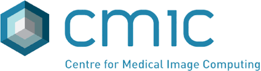

# TUS-REC Challenge

**Trackerless 3D Freehand Ultrasound Reconstruction (TUS-REC) Challenge**

Reconstructing 2D Ultrasound (US) images into a 3D volume enables 3D representations of anatomy to be generated which are beneficial to a wide range of downstream tasks such as quantitative biometric measurement, multimodal registration, 3D visualisation and interventional guidance. Although substantive progress has been made recently through non-deep-learning- and deep-learning-based approaches, this application is still challenging due to 1) inherent accumulated error - frame-to-frame transformation error will be accumulated through time when reconstructing long sequence of US frames, and 2) a lack of publicly-accessible data with synchronised spatial location, often obtained from tracking devices, for benchmarking the performance and for training learning-based methods. The TUS-REC challenge aims to provide a benchmark for freehand US reconstruction with publicly available in vivo US data from forearms of one hundred volunteers, using multiple predefined scanning protocols, targeted at improving the reconstruction performance in this challenging task. The outcome of the challenge includes 1) open-sourcing the first largest tracked US datasets with accurate positional information; 2) establishing one of the first benchmarks for 3D US reconstruction, suitable for modern learning-based data-driven approaches.

The TUS-REC challenge is an open call event, accepting new submissions after conference deadline. The fixed challenge submission timeline is associated with [MICCAI 2024](https://conferences.miccai.org/2024/en/), with the following [challenge timeline](#timeline).

**The full challenge description can be found [here](https://zenodo.org/doi/10.5281/zenodo.10991500).**

<!-- can be found [here](https://zenodo.org/record/7844908).** -->
**The train data is split into three parts: [Part 1](https://zenodo.org/doi/10.5281/zenodo.11178508), [Part 2](https://zenodo.org/doi/10.5281/zenodo.11180794), and [Part 3](https://zenodo.org/doi/10.5281/zenodo.11355499).**
<!-- **Sample baseline models for training and testing on the challenge data are accessible [here](https://github.com/muregpro/Baseline-Networks).** -->

**Baseline code is provided in this [repo](https://github.com/QiLi111/tus-rec-challenge_baseline).**
## Timeline

| Date                          | Challenge Milestone                              |
| ----------------------------- | ------------------------------------------------ |
| Apr. 1 2024                   | Registration Opens                               |
| May 13 2024                   | Training Data Release                            |
| Jul. 29 2024                  | Validation Data Release                          |
| Aug. 12 2024                  | Submissions begins                               |
| Aug. 19 2024                  | Submissions Closes                               |
| Sep. 16 2024                  | Winners Announcement and Speaker Invitations     |
| Oct. 6 2024                   | TUS-REC Challenge Event @ MICCAI 2024            |

The Challenge will take place on October 6th 2024 during the ASMUS Workshop. (Details for location, presentation, and event format: TBC.)

## The Task

This challenge aims to estimate the transformations among US frames, such that the entire US scan can be reconstructed in 3D space, both for establishing one of the first benchmarks for 3D US reconstruction and paving the way from experimental volunteer studies to potential clinical applications for this challenging task.

For detailed information, please refer to [task description](task.html), [dataset](data.html), [assessment](assessment.html), and [submission process](submission.html).

## Awards

The results from all participants will be made publicly available on leaderboards unless the submitted codes incurred errors during the evaluation process. Teams are allowed to make multiple distinct submissions (but must ensure they are not merely simple variations in hyperparameter values). The leaderboards will be accessible for public viewing [here](leaderboard.html).

- The first-place and runner-up achievers will receive additional certificates.
- Participants who successfully participated the challenge will be awarded certificates of participation.

## Discussion Board 

TBA on GitHub

## Organizers

Qi Li, University College London

Shaheer U. Saeed, University College London

Dean C. Barratt, University College London

Matthew J. Clarkson, University College London

Tom Vercauteren, King's College London

Yipeng Hu, University College London

Challenge Contact E-Mail: [`qi.li.21@ucl.ac.uk`](mailto:qi.li.21@ucl.ac.uk)

## Sponsors

  
  
  
  
  

