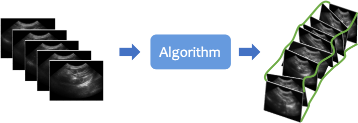

# Freehand US Reconstruction

The aim of Freehand US reconstruction is to estimate the transformation between any pair of US frames in a US scan without any external tracker, and thus reconstruct 2D Ultrasound (US) images into a 3D volume (see [Fig. 1](#figure1)).

  

Fig. 1. An example workflow of freehand US reconstruction.

<!-- 

  

 -->
<!-- <figure>
  
  <figcaption>Figure 1: An example workflow of freehand US reconstruction.</figcaption>
</figure> -->

For an US scan $ \mathcal{S}$, image sequences comprising $M$ 2D frames can be sampled as $S=\{I_m\}, m=1,2,...,M$, where $S \subseteq {\mathcal{S}}$ and $m$ represents consecutively increasing time-steps at which the frames are acquired. Let $T_{j\leftarrow i}, 1 \leq i<j \leq M$ denote the rigid transformation from the $i^{th}$ frame to the $j^{th}$ frame. Reconstructing the 3D US volume and the trajectory of the US probe requires determining the position of each frame. Since freehand US systems lack an absolute coordinate system, the first frame is chosen as the reference with $T_1=I$, where $I$ is the identity matrix. As a result, only the relative transformations with respect to the first frame are needed.

In general, prior studies have formulated the freehand US problem as the estimation of the transformation between two frames in an US sequence. This estimation relies on a function $f$, which serves as the core of the problem, as expressed in [Eq. 1](#freehandUS):  

$$
T_{j\leftarrow i} \approx f(I_i, I_j)
$$

Typically, adjacent frames are used in [Eq. 1](#freehandUS), where $j = i+1$. The position of each frame $T_m$ can be computed by recursively multiplying the previously estimated relative transformations, as shown in [Eq. 2](#chain-multiplying):

$$
T_m=T_{m\leftarrow m-1} \times \cdots \times T_{3\leftarrow 2} \times T_{2\leftarrow 1} \times T_{1}
$$

# Task Description

The algorithm is expected to take the entire scan as input and output two different sets of
transformation-representing displacement vectors as results, a set of displacement vectors on individual pixels and a set of displacement vectors on provided landmarks. There is no requirement on how the algorithm is designed internally, for example, whether it is learning-based method; frame-, sequence- or scan-based processing; or, rigid-, affine- or nonrigid transformation assumptions. Details are explained further in [assessment](assessment2025.html).

Participant teams are expected to make use of the sequential data and potentially make knowledge transfer from other domains such as computer vision and computer-assisted intervention. The participant teams are expected to take US scan as input and output two sets of pixel displacement vectors, indicating the transformation to reference frame, i.e., first frame in this task. The evaluation process will take the generated displacement vectors from their dockerized models, and produce the final accuracy score to represent the reconstruction performance, at local and global levels, representing different clinical application of the reconstruction methods.

We provide a baseline algorithm adapted from <a href="https://doi.org/10.1109/TBME.2023.3325551" target="_blank">Li et al. 2023</a> in this <a href="TBA" target="_blank">repo</a>. [TBA]

# Application scenarios

Trackless 3D freehand US reconstruction will be useful in clinical practice where 3D visualisation is required but external trackers are not allowed or inaccessible. By estimating the relative transformations among US frames using solely 2D US images, the 3D position for each US frame could be calculated and thus the entire US scan could be reconstructed without using any information from external trackers.

# Difference between TUS-REC2025 and TUS-REC2024

From the results of TUS-REC2024, we observed that the reconstruction performance is dependent on scan protocol. In TUS-REC2025, we want to investigate the reconstruction performance on scans with a new rotating scanning protocol, with which the reconstruction performance may be further improved owing to its dense sampling of the area to be reconstructed. Compared with TUS-REC2024, TUS-REC2025 provides more data with new scanning protocol, and the previous released larger data with non-rotating scanning protocols is open to use. The new challenge aims to 1) benchmark the model performance on relatively small rotating data and 2) benchmark the model generalisation ability among different scanning protocols.